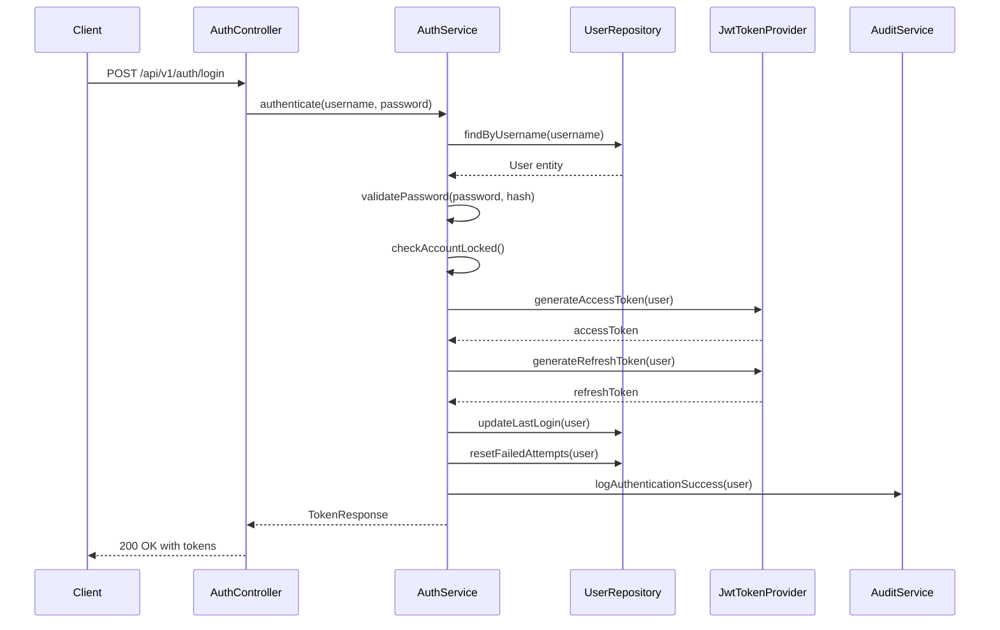

# Design Document: Module 1 - User Management

## Overview

The User Management module provides comprehensive user account lifecycle management for the IT Infrastructure Asset Management System. This module serves as the foundation for access control across all system modules, implementing authentication, authorization, user CRUD operations, role management, and profile management.

### Purpose

This module enables:
- Secure user authentication with JWT-based stateless sessions
- Role-based access control (RBAC) with three roles: Administrator, Asset_Manager, and Viewer
- Complete user account lifecycle management (create, read, update, delete)
- User profile self-service capabilities
- Account security features including password complexity, account locking, and session management
- Comprehensive audit logging of all user management operations

### Key Features

1. **Authentication Service**: Handles user login, logout, token generation, and refresh
2. **Authorization Service**: Enforces role-based permissions across all operations
3. **User Service**: Manages user account CRUD operations, role assignments, and account status
4. **Profile Service**: Enables users to view and update their own profile and change passwords
5. **Session Management**: Tracks active sessions and enforces token expiration policies
6. **Security Controls**: Implements account locking, password complexity, and audit logging

### Technology Stack

- **Backend Framework**: Spring Boot 3.x with Java 17
- **Security**: Spring Security with JWT authentication
- **Database**: Microsoft SQL Server 2019+ with Spring Data JPA
- **Password Hashing**: BCrypt with strength 10
- **Token Format**: JSON Web Tokens (JWT) with HS256 signing
- **API Style**: RESTful with OpenAPI/Swagger documentation

## Architecture

### High-Level Architecture

The User Management module follows a layered architecture with clear separation of concerns:

```
┌─────────────────────────────────────────────────────────────┐
│                     Presentation Layer                       │
│  ┌──────────────┐  ┌──────────────┐  ┌──────────────┐      │
│  │   Auth       │  │    User      │  │   Profile    │      │
│  │ Controller   │  │  Controller  │  │  Controller  │      │
│  └──────────────┘  └──────────────┘  └──────────────┘      │
└─────────────────────────────────────────────────────────────┘
                            │
┌─────────────────────────────────────────────────────────────┐
│                      Security Layer                          │
│  ┌──────────────────────────────────────────────────────┐   │
│  │         JWT Authentication Filter                     │   │
│  │  (JwtAuthenticationFilter)                           │   │
│  └──────────────────────────────────────────────────────┘   │
│  ┌──────────────────────────────────────────────────────┐   │
│  │         Spring Security Configuration                 │   │
│  │  (SecurityConfig)                                    │   │
│  └──────────────────────────────────────────────────────┘   │
└─────────────────────────────────────────────────────────────┘
                            │
┌─────────────────────────────────────────────────────────────┐
│                      Service Layer                           │
│  ┌──────────────┐  ┌──────────────┐  ┌──────────────┐      │
│  │ Authentication│  │     User     │  │   Profile    │      │
│  │   Service    │  │   Service    │  │   Service    │      │
│  └──────────────┘  └──────────────┘  └──────────────┘      │
│  ┌──────────────┐  ┌──────────────┐                        │
│  │Authorization │  │    Audit     │                        │
│  │   Service    │  │   Service    │                        │
│  └──────────────┘  └──────────────┘                        │
└─────────────────────────────────────────────────────────────┘
                            │
┌─────────────────────────────────────────────────────────────┐
│                    Persistence Layer                         │
│  ┌──────────────┐  ┌──────────────┐  ┌──────────────┐      │
│  │     User     │  │   UserRole   │  │   Session    │      │
│  │  Repository  │  │  Repository  │  │  Repository  │      │
│  └──────────────┘  └──────────────┘  └──────────────┘      │
└─────────────────────────────────────────────────────────────┘
                            │
┌─────────────────────────────────────────────────────────────┐
│                       Database Layer                         │
│              Microsoft SQL Server 2019+                      │
│  ┌──────────────┐  ┌──────────────┐  ┌──────────────┐      │
│  │    Users     │  │  UserRoles   │  │   Sessions   │      │
│  │    Table     │  │    Table     │  │    Table     │      │
│  └──────────────┘  └──────────────┘  └──────────────┘      │
└─────────────────────────────────────────────────────────────┘
```

### Service Interactions



### Component Responsibilities

**Authentication Service**:
- Validates user credentials
- Generates JWT access and refresh tokens
- Manages account locking after failed attempts
- Handles token refresh operations
- Invalidates sessions on logout

**Authorization Service**:
- Verifies user permissions for operations
- Enforces role-based access control
- Validates JWT tokens
- Checks account status (active/inactive)

**User Service**:
- Creates, reads, updates, and deletes user accounts
- Assigns and revokes roles
- Enables and disables accounts
- Validates username and email uniqueness
- Enforces business rules (e.g., cannot delete own account)

**Profile Service**:
- Retrieves current user profile
- Updates user profile information
- Changes user passwords with validation
- Invalidates sessions after password change

**Audit Service**:
- Logs all authentication events
- Records user management operations
- Tracks role changes
- Maintains immutable audit trail

## Components and Interfaces

### Domain Entities

#### User Entity

```java
@Entity
@Table(name = "Users", indexes = {
    @Index(name = "IX_Users_Username", columnList = "username"),
    @Index(name = "IX_Users_Email", columnList = "email"),
    @Index(name = "IX_Users_AccountLocked", columnList = "accountLocked")
})
public class User {
    @Id
    @GeneratedValue(strategy = GenerationType.AUTO)
    private UUID id;
    
    @Column(nullable = false, unique = true, length = 100)
    private String username;
    
    @Column(nullable = false, length = 255)
    private String passwordHash;
    
    @Column(nullable = false, unique = true, length = 255)
    private String email;
    
    @Column(nullable = false)
    private Boolean isActive = true;
    
    @Column(nullable = false)
    private Boolean accountLocked = false;
    
    @Column
    private LocalDateTime lockUntil;
    
    @Column(nullable = false)
    private Integer failedLoginAttempts = 0;
    
    @Column
    private LocalDateTime lastLoginAt;
    
    @CreatedDate
    @Column(nullable = false, updatable = false)
    private LocalDateTime createdAt;
    
    @LastModifiedDate
    @Column(nullable = false)
    private LocalDateTime updatedAt;
    
    @ManyToOne(fetch = FetchType.LAZY)
    @JoinColumn(name = "createdBy")
    private User createdBy;
    
    @ManyToOne(fetch = FetchType.LAZY)
    @JoinColumn(name = "updatedBy")
    private User updatedBy;
    
    @OneToMany(mappedBy = "user", cascade = CascadeType.ALL, orphanRemoval = true)
    private Set<UserRole> roles = new HashSet<>();
    
    // Getters, setters, equals, hashCode
}
```

#### UserRole Entity

```java
@Entity
@Table(name = "UserRoles", indexes = {
    @Index(name = "IX_UserRoles_UserId", columnList = "userId"),
    @Index(name = "IX_UserRoles_Role", columnList = "role")
})
public class UserRole {
    @Id
    @GeneratedValue(strategy = GenerationType.AUTO)
    private UUID id;
    
    @ManyToOne(fetch = FetchType.LAZY)
    @JoinColumn(name = "userId", nullable = false)
    private User user;
    
    @Column(nullable = false, length = 50)
    @Enumerated(EnumType.STRING)
    private Role role;
    
    @ManyToOne(fetch = FetchType.LAZY)
    @JoinColumn(name = "assignedBy", nullable = false)
    private User assignedBy;
    
    @CreatedDate
    @Column(nullable = false, updatable = false)
    private LocalDateTime assignedAt;
    
    // Getters, setters, equals, hashCode
}
```

#### Session Entity

```java
@Entity
@Table(name = "Sessions", indexes = {
    @Index(name = "IX_Sessions_UserId", columnList = "userId"),
    @Index(name = "IX_Sessions_TokenExpiration", columnList = "tokenExpiration")
})
public class Session {
    @Id
    @GeneratedValue(strategy = GenerationType.AUTO)
    private UUID id;
    
    @ManyToOne(fetch = FetchType.LAZY)
    @JoinColumn(name = "userId", nullable = false)
    private User user;
    
    @Column(nullable = false)
    private LocalDateTime loginAt;
    
    @Column
    private LocalDateTime logoutAt;
    
    @Column(nullable = false)
    private LocalDateTime tokenExpiration;
    
    @Column(nullable = false)
    private Boolean isActive = true;
    
    @Column(length = 500)
    private String accessTokenHash;
    
    @Column(length = 500)
    private String refreshTokenHash;
    
    // Getters, setters
}
```

### Role Enum

```java
public enum Role {
    ADMINISTRATOR,
    ASSET_MANAGER,
    VIEWER
}
```

### DTOs and Request/Response Objects

#### LoginRequest

```java
public class LoginRequest {
    @NotBlank(message = "Username is required")
    private String username;
    
    @NotBlank(message = "Password is required")
    private String password;
    
    // Getters, setters
}
```

#### TokenResponse

```java
public class TokenResponse {
    private String accessToken;
    private String refreshToken;
    private String tokenType = "Bearer";
    private Long expiresIn;
    
    // Getters, setters
}
```

#### UserRequest

```java
public class UserRequest {
    @NotBlank(message = "Username is required")
    @Size(min = 3, max = 100, message = "Username must be between 3 and 100 characters")
    @Pattern(regexp = "^[a-zA-Z0-9_]+$", message = "Username must contain only alphanumeric characters and underscores")
    private String username;
    
    @NotBlank(message = "Email is required")
    @Email(message = "Invalid email format")
    @Size(min = 5, max = 255, message = "Email must be between 5 and 255 characters")
    private String email;
    
    @NotBlank(message = "Password is required")
    @Pattern(
        regexp = "^(?=.*[a-z])(?=.*[A-Z])(?=.*\\d)(?=.*[@$!%*?&])[A-Za-z\\d@$!%*?&]{8,}$",
        message = "Password must contain at least 8 characters, one uppercase letter, one lowercase letter, one digit, and one special character"
    )
    private String password;
    
    @NotNull(message = "At least one role is required")
    @Size(min = 1, message = "At least one role is required")
    private Set<Role> roles;
    
    // Getters, setters
}
```

#### UserDTO

```java
public class UserDTO {
    private UUID id;
    private String username;
    private String email;
    private Boolean isActive;
    private Boolean accountLocked;
    private LocalDateTime lockUntil;
    private LocalDateTime lastLoginAt;
    private Set<Role> roles;
    private LocalDateTime createdAt;
    private LocalDateTime updatedAt;
    private String createdBy;
    private String updatedBy;
    
    // Getters, setters
}
```

#### ChangePasswordRequest

```java
public class ChangePasswordRequest {
    @NotBlank(message = "Current password is required")
    private String currentPassword;
    
    @NotBlank(message = "New password is required")
    @Pattern(
        regexp = "^(?=.*[a-z])(?=.*[A-Z])(?=.*\\d)(?=.*[@$!%*?&])[A-Za-z\\d@$!%*?&]{8,}$",
        message = "Password must contain at least 8 characters, one uppercase letter, one lowercase letter, one digit, and one special character"
    )
    private String newPassword;
    
    // Getters, setters
}
```

### Service Interfaces

#### AuthenticationService

```java
public interface AuthenticationService {
    /**
     * Authenticates a user with username and password.
     * 
     * @param request login credentials
     * @return token response with access and refresh tokens
     * @throws AuthenticationException if credentials are invalid
     * @throws AccountLockedException if account is locked
     * @throws AccountDisabledException if account is inactive
     */
    TokenResponse login(LoginRequest request);
    
    /**
     * Logs out a user and invalidates their session.
     * 
     * @param userId the user ID
     */
    void logout(String userId);
    
    /**
     * Refreshes an access token using a valid refresh token.
     * 
     * @param refreshToken the refresh token
     * @return new token response
     * @throws AuthenticationException if refresh token is invalid
     */
    TokenResponse refreshToken(String refreshToken);
}
```

#### AuthorizationService

```java
public interface AuthorizationService {
    /**
     * Checks if a user has permission to perform an action.
     * 
     * @param userId the user ID
     * @param action the action to check
     * @return true if user has permission
     */
    boolean hasPermission(String userId, Action action);
    
    /**
     * Checks if a user has a specific role.
     * 
     * @param userId the user ID
     * @param role the role to check
     * @return true if user has the role
     */
    boolean hasRole(String userId, Role role);
    
    /**
     * Validates that a user is active and not locked.
     * 
     * @param userId the user ID
     * @throws AccountLockedException if account is locked
     * @throws AccountDisabledException if account is inactive
     */
    void validateAccountStatus(String userId);
}
```

#### UserService

```java
public interface UserService {
    /**
     * Creates a new user account.
     * 
     * @param creatorId the ID of the user creating the account
     * @param request user creation request
     * @return created user DTO
     * @throws InsufficientPermissionsException if creator lacks permission
     * @throws ValidationException if request data is invalid
     * @throws DuplicateUsernameException if username already exists
     * @throws DuplicateEmailException if email already exists
     */
    UserDTO createUser(String creatorId, UserRequest request);
    
    /**
     * Retrieves a user by ID.
     * 
     * @param userId the user ID
     * @return user DTO if found
     */
    Optional<UserDTO> getUser(String userId);
    
    /**
     * Retrieves all users with pagination.
     * 
     * @param pageable pagination parameters
     * @return page of user DTOs
     */
    Page<UserDTO> getAllUsers(Pageable pageable);
    
    /**
     * Retrieves users by role.
     * 
     * @param role the role to filter by
     * @param pageable pagination parameters
     * @return page of user DTOs
     */
    Page<UserDTO> getUsersByRole(Role role, Pageable pageable);
    
    /**
     * Updates a user account.
     * 
     * @param updaterId the ID of the user performing the update
     * @param userId the user ID to update
     * @param request update request
     * @return updated user DTO
     * @throws InsufficientPermissionsException if updater lacks permission
     * @throws UserNotFoundException if user not found
     * @throws ValidationException if request data is invalid
     */
    UserDTO updateUser(String updaterId, String userId, UserUpdateRequest request);
    
    /**
     * Deletes a user account.
     * 
     * @param deleterId the ID of the user performing the deletion
     * @param userId the user ID to delete
     * @throws InsufficientPermissionsException if deleter lacks permission
     * @throws UserNotFoundException if user not found
     * @throws ValidationException if attempting to delete own account
     */
    void deleteUser(String deleterId, String userId);
    
    /**
     * Enables a user account.
     * 
     * @param adminId the ID of the administrator
     * @param userId the user ID to enable
     * @throws InsufficientPermissionsException if admin lacks permission
     * @throws UserNotFoundException if user not found
     */
    void enableUser(String adminId, String userId);
    
    /**
     * Disables a user account.
     * 
     * @param adminId the ID of the administrator
     * @param userId the user ID to disable
     * @throws InsufficientPermissionsException if admin lacks permission
     * @throws UserNotFoundException if user not found
     * @throws ValidationException if attempting to disable own account
     */
    void disableUser(String adminId, String userId);
    
    /**
     * Assigns a role to a user.
     * 
     * @param adminId the ID of the administrator
     * @param userId the user ID
     * @param role the role to assign
     * @throws InsufficientPermissionsException if admin lacks permission
     * @throws UserNotFoundException if user not found
     * @throws ValidationException if user already has the role
     */
    void assignRole(String adminId, String userId, Role role);
    
    /**
     * Revokes a role from a user.
     * 
     * @param adminId the ID of the administrator
     * @param userId the user ID
     * @param role the role to revoke
     * @throws InsufficientPermissionsException if admin lacks permission
     * @throws UserNotFoundException if user not found
     * @throws ValidationException if user doesn't have the role or it's their last role
     */
    void revokeRole(String adminId, String userId, Role role);
}
```

#### ProfileService

```java
public interface ProfileService {
    /**
     * Retrieves the current user's profile.
     * 
     * @param userId the user ID
     * @return user profile DTO
     * @throws UserNotFoundException if user not found
     */
    UserDTO getProfile(String userId);
    
    /**
     * Updates the current user's profile.
     * 
     * @param userId the user ID
     * @param request profile update request
     * @return updated user profile DTO
     * @throws UserNotFoundException if user not found
     * @throws ValidationException if request data is invalid
     */
    UserDTO updateProfile(String userId, ProfileUpdateRequest request);
    
    /**
     * Changes the current user's password.
     * 
     * @param userId the user ID
     * @param request password change request
     * @throws UserNotFoundException if user not found
     * @throws ValidationException if current password is incorrect or new password is invalid
     */
    void changePassword(String userId, ChangePasswordRequest request);
}
```

### REST API Endpoints

#### Authentication Endpoints

```
POST   /api/v1/auth/login           - Authenticate user and get tokens
POST   /api/v1/auth/logout          - Logout and invalidate session
POST   /api/v1/auth/refresh         - Refresh access token
```

#### User Management Endpoints

```
POST   /api/v1/users                - Create new user (Admin only)
GET    /api/v1/users                - List all users with pagination
GET    /api/v1/users/{id}           - Get user by ID
PUT    /api/v1/users/{id}           - Update user (Admin only)
DELETE /api/v1/users/{id}           - Delete user (Admin only)
PATCH  /api/v1/users/{id}/enable    - Enable user account (Admin only)
PATCH  /api/v1/users/{id}/disable   - Disable user account (Admin only)
POST   /api/v1/users/{id}/roles     - Assign role to user (Admin only)
DELETE /api/v1/users/{id}/roles/{role} - Revoke role from user (Admin only)
```

#### Profile Endpoints

```
GET    /api/v1/profile              - Get current user profile
PUT    /api/v1/profile              - Update current user profile
POST   /api/v1/profile/change-password - Change current user password
```

## Data Models

### Database Schema

#### Users Table

```sql
CREATE TABLE Users (
    Id UNIQUEIDENTIFIER PRIMARY KEY DEFAULT NEWID(),
    Username NVARCHAR(100) NOT NULL UNIQUE,
    PasswordHash NVARCHAR(255) NOT NULL,
    Email NVARCHAR(255) NOT NULL UNIQUE,
    IsActive BIT NOT NULL DEFAULT 1,
    AccountLocked BIT NOT NULL DEFAULT 0,
    LockUntil DATETIME2 NULL,
    FailedLoginAttempts INT NOT NULL DEFAULT 0,
    LastLoginAt DATETIME2 NULL,
    CreatedAt DATETIME2 NOT NULL DEFAULT GETUTCDATE(),
    UpdatedAt DATETIME2 NOT NULL DEFAULT GETUTCDATE(),
    CreatedBy UNIQUEIDENTIFIER NULL,
    UpdatedBy UNIQUEIDENTIFIER NULL,
    
    CONSTRAINT FK_Users_CreatedBy FOREIGN KEY (CreatedBy) REFERENCES Users(Id),
    CONSTRAINT FK_Users_UpdatedBy FOREIGN KEY (UpdatedBy) REFERENCES Users(Id),
    CONSTRAINT CHK_Users_Username CHECK (LEN(Username) >= 3 AND LEN(Username) <= 100),
    CONSTRAINT CHK_Users_Email CHECK (LEN(Email) >= 5 AND LEN(Email) <= 255)
);

CREATE INDEX IX_Users_Username ON Users(Username);
CREATE INDEX IX_Users_Email ON Users(Email);
CREATE INDEX IX_Users_AccountLocked ON Users(AccountLocked);
CREATE INDEX IX_Users_IsActive ON Users(IsActive);
```

#### UserRoles Table

```sql
CREATE TABLE UserRoles (
    Id UNIQUEIDENTIFIER PRIMARY KEY DEFAULT NEWID(),
    UserId UNIQUEIDENTIFIER NOT NULL,
    Role NVARCHAR(50) NOT NULL,
    AssignedBy UNIQUEIDENTIFIER NOT NULL,
    AssignedAt DATETIME2 NOT NULL DEFAULT GETUTCDATE(),
    
    CONSTRAINT FK_UserRoles_UserId FOREIGN KEY (UserId) REFERENCES Users(Id) ON DELETE CASCADE,
    CONSTRAINT FK_UserRoles_AssignedBy FOREIGN KEY (AssignedBy) REFERENCES Users(Id),
    CONSTRAINT CHK_UserRoles_Role CHECK (Role IN ('Administrator', 'Asset_Manager', 'Viewer')),
    CONSTRAINT UQ_UserRoles_UserId_Role UNIQUE (UserId, Role)
);

CREATE INDEX IX_UserRoles_UserId ON UserRoles(UserId);
CREATE INDEX IX_UserRoles_Role ON UserRoles(Role);
```

#### Sessions Table

```sql
CREATE TABLE Sessions (
    Id UNIQUEIDENTIFIER PRIMARY KEY DEFAULT NEWID(),
    UserId UNIQUEIDENTIFIER NOT NULL,
    LoginAt DATETIME2 NOT NULL DEFAULT GETUTCDATE(),
    LogoutAt DATETIME2 NULL,
    TokenExpiration DATETIME2 NOT NULL,
    IsActive BIT NOT NULL DEFAULT 1,
    AccessTokenHash NVARCHAR(500) NULL,
    RefreshTokenHash NVARCHAR(500) NULL,
    
    CONSTRAINT FK_Sessions_UserId FOREIGN KEY (UserId) REFERENCES Users(Id) ON DELETE CASCADE
);

CREATE INDEX IX_Sessions_UserId ON Sessions(UserId);
CREATE INDEX IX_Sessions_TokenExpiration ON Sessions(TokenExpiration);
CREATE INDEX IX_Sessions_IsActive ON Sessions(IsActive);
```

### Entity Relationships

```
Users (1) ──────< (N) UserRoles
  │
  │ CreatedBy
  └──────────────> Users (self-reference)
  │
  │ UpdatedBy
  └──────────────> Users (self-reference)
  │
  │
  └──────< (N) Sessions

UserRoles (N) ──────> (1) Users (AssignedBy)
```

### Data Validation Rules

**Username**:
- Required, not null
- Unique across all users
- Length: 3-100 characters
- Pattern: Alphanumeric and underscores only (`^[a-zA-Z0-9_]+$`)

**Email**:
- Required, not null
- Unique across all users
- Length: 5-255 characters
- Format: Valid email format

**Password**:
- Required for creation
- Minimum 8 characters
- Must contain: 1 uppercase, 1 lowercase, 1 digit, 1 special character
- Hashed with BCrypt strength 10 before storage
- Never returned in API responses

**Role**:
- Must be one of: Administrator, Asset_Manager, Viewer
- User must have at least one role
- Cannot revoke last role from user

**Account Status**:
- IsActive: Boolean, defaults to true
- AccountLocked: Boolean, defaults to false
- LockUntil: Nullable datetime, set when account is locked

## Correctness Properties

*A property is a characteristic or behavior that should hold true across all valid executions of a system—essentially, a formal statement about what the system should do. Properties serve as the bridge between human-readable specifications and machine-verifiable correctness guarantees.*

### Property 1: Username Uniqueness
**For all users u1 and u2 in the system, if u1 ≠ u2, then u1.username ≠ u2.username**

This property ensures that no two distinct users can have the same username.

### Property 2: Email Uniqueness
**For all users u1 and u2 in the system, if u1 ≠ u2, then u1.email ≠ u2.email**

This property ensures that no two distinct users can have the same email address.

### Property 3: Password Hash Storage
**For all users u in the system, u.passwordHash is a BCrypt hash with strength ≥ 10, and the plain-text password is never stored**

This property ensures passwords are always hashed before storage and never stored in plain text.

### Property 4: Token Expiration Consistency
**For all access tokens t, t.expiresAt = t.createdAt + 30 minutes**

This property ensures all access tokens have exactly 30-minute expiration.

### Property 5: Refresh Token Expiration Consistency
**For all refresh tokens r, r.expiresAt = r.createdAt + 24 hours**

This property ensures all refresh tokens have exactly 24-hour expiration.

### Property 6: Account Lock Duration
**For all users u, if u.accountLocked = true, then u.lockUntil = u.lastFailedLoginAt + 30 minutes**

This property ensures locked accounts are locked for exactly 30 minutes.

### Property 7: Failed Login Attempt Threshold
**For all users u, if u.failedLoginAttempts ≥ 5, then u.accountLocked = true**

This property ensures accounts are locked after 5 consecutive failed login attempts.

### Property 8: Successful Login Resets Failed Attempts
**For all users u, if login(u) succeeds, then u.failedLoginAttempts = 0**

This property ensures the failed login counter is reset upon successful authentication.

### Property 9: Role Assignment Validity
**For all user roles r, r.role ∈ {Administrator, Asset_Manager, Viewer}**

This property ensures only valid roles can be assigned to users.

### Property 10: Minimum Role Requirement
**For all users u, |u.roles| ≥ 1**

This property ensures every user has at least one role assigned.

### Property 11: Role Uniqueness Per User
**For all users u and roles r1, r2 in u.roles, if r1 ≠ r2, then r1.role ≠ r2.role**

This property ensures a user cannot have duplicate role assignments.

### Property 12: Session Validity
**For all sessions s, if s.isActive = true, then s.tokenExpiration > currentTime**

This property ensures active sessions have not expired.

### Property 13: Logout Invalidates Session
**For all sessions s, if logout(s.user) is called, then s.isActive = false and s.logoutAt = currentTime**

This property ensures logout properly terminates sessions.

### Property 14: Password Change Invalidates Sessions
**For all users u, if changePassword(u) succeeds, then for all sessions s where s.user = u, s.isActive = false**

This property ensures all user sessions are invalidated when password is changed.

### Property 15: Account Disable Invalidates Sessions
**For all users u, if disableUser(u) is called, then for all sessions s where s.user = u, s.isActive = false**

This property ensures all user sessions are invalidated when account is disabled.

### Property 16: Role Change Invalidates Sessions
**For all users u, if assignRole(u, r) or revokeRole(u, r) is called, then for all sessions s where s.user = u, s.isActive = false**

This property ensures all user sessions are invalidated when roles change to refresh permissions.

### Property 17: Administrator Permission Completeness
**For all users u where Administrator ∈ u.roles, hasPermission(u, action) = true for all actions**

This property ensures administrators have all permissions.

### Property 18: Self-Account Deletion Prevention
**For all users u, deleteUser(u, u.id) throws ValidationException**

This property ensures users cannot delete their own accounts.

### Property 19: Self-Account Disable Prevention
**For all users u, disableUser(u, u.id) throws ValidationException**

This property ensures users cannot disable their own accounts.

### Property 20: Self-Administrator Role Revocation Prevention
**For all users u where Administrator ∈ u.roles, revokeRole(u, u.id, Administrator) throws ValidationException**

This property ensures administrators cannot revoke their own administrator role.

### Property 21: Last Role Revocation Prevention
**For all users u, if |u.roles| = 1, then revokeRole(u, u.roles[0]) throws ValidationException**

This property ensures users always have at least one role.

### Property 22: Inactive Account Login Prevention
**For all users u, if u.isActive = false, then login(u) throws AccountDisabledException**

This property ensures inactive accounts cannot authenticate.

### Property 23: Locked Account Login Prevention
**For all users u, if u.accountLocked = true and u.lockUntil > currentTime, then login(u) throws AccountLockedException**

This property ensures locked accounts cannot authenticate until lock expires.

### Property 24: Password Complexity Enforcement
**For all passwords p, p must match the pattern: ^(?=.*[a-z])(?=.*[A-Z])(?=.*\d)(?=.*[@$!%*?&])[A-Za-z\d@$!%*?&]{8,}$**

This property ensures all passwords meet complexity requirements.

### Property 25: Username Format Enforcement
**For all usernames u, u must match the pattern: ^[a-zA-Z0-9_]+$ and 3 ≤ |u| ≤ 100**

This property ensures usernames contain only valid characters and meet length requirements.

### Property 26: Email Format Enforcement
**For all emails e, e must be a valid email format and 5 ≤ |e| ≤ 255**

This property ensures emails are valid and meet length requirements.

### Property 27: Password Hash Exclusion from Responses
**For all API responses r containing user data, r.passwordHash is undefined or null**

This property ensures password hashes are never exposed in API responses.

### Property 28: Audit Log Immutability
**For all audit log entries a, once created, a cannot be updated or deleted**

This property ensures audit logs maintain integrity and cannot be tampered with.

### Property 29: Authentication Event Logging
**For all login attempts l, an audit log entry is created with userId, timestamp, and result (success/failure)**

This property ensures all authentication attempts are logged.

### Property 30: User Creation Audit Logging
**For all user creation operations c, an audit log entry is created with creatorId, newUserId, and timestamp**

This property ensures user creation is audited.

### Property 31: User Update Audit Logging
**For all user update operations u, an audit log entry is created with updaterId, userId, changedFields, and timestamp**

This property ensures user updates are audited.

### Property 32: User Deletion Audit Logging
**For all user deletion operations d, an audit log entry is created with deleterId, deletedUserId, and timestamp**

This property ensures user deletions are audited.

### Property 33: Role Change Audit Logging
**For all role assignment/revocation operations r, an audit log entry is created with adminId, userId, role, action, and timestamp**

This property ensures role changes are audited.

### Property 34: Password Change Audit Logging
**For all password change operations p, an audit log entry is created with userId and timestamp (but not the password)**

This property ensures password changes are audited without exposing passwords.

### Property 35: Token Payload Completeness
**For all JWT tokens t, t.payload contains userId and roles**

This property ensures tokens contain necessary information for authorization.

### Property 36: Refresh Token Single Use
**For all refresh tokens r, once r is used to generate a new access token, a new refresh token is issued**

This property ensures refresh token rotation for enhanced security.

### Property 37: Session Creation on Login
**For all successful login operations l, a session record s is created with s.userId = l.userId, s.loginAt = currentTime, and s.isActive = true**

This property ensures sessions are properly tracked.

### Property 38: Pagination Consistency
**For all paginated queries q with page p and size s, the result contains at most s items**

This property ensures pagination limits are respected.

### Property 39: Authorization Check Before Operations
**For all state-changing operations o on user u by actor a, hasPermission(a, o.action) is checked before o executes**

This property ensures authorization is enforced before all operations.

### Property 40: Account Status Validation Before Authentication
**For all authentication attempts a for user u, u.isActive and !u.accountLocked are verified before password validation**

This property ensures account status is checked before processing credentials.

## Additional DTOs

### UserUpdateRequest

```java
public class UserUpdateRequest {
    @Size(min = 3, max = 100, message = "Username must be between 3 and 100 characters")
    @Pattern(regexp = "^[a-zA-Z0-9_]+$", message = "Username must contain only alphanumeric characters and underscores")
    private String username;
    
    @Email(message = "Invalid email format")
    @Size(min = 5, max = 255, message = "Email must be between 5 and 255 characters")
    private String email;
    
    // Note: Password updates are not allowed through this endpoint
    // Use ProfileService.changePassword() instead
    
    // Getters, setters
}
```

### ProfileUpdateRequest

```java
public class ProfileUpdateRequest {
    @Email(message = "Invalid email format")
    @Size(min = 5, max = 255, message = "Email must be between 5 and 255 characters")
    private String email;
    
    // Note: Username and roles cannot be changed through profile endpoint
    // Note: Password changes use separate changePassword endpoint
    
    // Getters, setters
}
```

### RefreshTokenRequest

```java
public class RefreshTokenRequest {
    @NotBlank(message = "Refresh token is required")
    private String refreshToken;
    
    // Getters, setters
}
```

### RoleAssignmentRequest

```java
public class RoleAssignmentRequest {
    @NotNull(message = "Role is required")
    private Role role;
    
    // Getters, setters
}
```

## Exception Classes

### AccountLockedException

```java
public class AccountLockedException extends RuntimeException {
    private final LocalDateTime lockUntil;
    
    public AccountLockedException(LocalDateTime lockUntil) {
        super("Account is locked until " + lockUntil);
        this.lockUntil = lockUntil;
    }
    
    public LocalDateTime getLockUntil() {
        return lockUntil;
    }
}
```

### AccountDisabledException

```java
public class AccountDisabledException extends RuntimeException {
    public AccountDisabledException() {
        super("Account is disabled");
    }
}
```

### DuplicateUsernameException

```java
public class DuplicateUsernameException extends RuntimeException {
    private final String username;
    
    public DuplicateUsernameException(String username) {
        super("Username already exists: " + username);
        this.username = username;
    }
    
    public String getUsername() {
        return username;
    }
}
```

### DuplicateEmailException

```java
public class DuplicateEmailException extends RuntimeException {
    private final String email;
    
    public DuplicateEmailException(String email) {
        super("Email already exists: " + email);
        this.email = email;
    }
    
    public String getEmail() {
        return email;
    }
}
```

### UserNotFoundException

```java
public class UserNotFoundException extends RuntimeException {
    private final String userId;
    
    public UserNotFoundException(String userId) {
        super("User not found: " + userId);
        this.userId = userId;
    }
    
    public String getUserId() {
        return userId;
    }
}
```

## Security Considerations

### Password Security

1. **BCrypt Hashing**: All passwords are hashed using BCrypt with strength 10 before storage
2. **Password Complexity**: Enforced through validation annotations and regex patterns
3. **Password Transmission**: Passwords are only transmitted over HTTPS
4. **Password Storage**: Plain-text passwords are never stored or logged

### Token Security

1. **JWT Signing**: Tokens are signed using HS256 algorithm with a secure secret key
2. **Token Expiration**: Access tokens expire after 30 minutes, refresh tokens after 24 hours
3. **Token Rotation**: New refresh tokens are issued when used
4. **Token Invalidation**: Tokens are invalidated on logout, password change, and role changes

### Session Security

1. **Session Tracking**: All active sessions are tracked in the database
2. **Session Invalidation**: Sessions are invalidated on logout, password change, account disable, and role changes
3. **Session Cleanup**: Expired sessions should be periodically cleaned up

### Account Security

1. **Account Locking**: Accounts are locked for 30 minutes after 5 failed login attempts
2. **Account Status**: Inactive accounts cannot authenticate
3. **Self-Protection**: Users cannot delete or disable their own accounts or revoke their own admin role

### Authorization Security

1. **Permission Checks**: All operations verify user permissions before execution
2. **Role-Based Access**: Permissions are determined by assigned roles
3. **Token Validation**: JWT tokens are validated on every protected request

## Performance Considerations

### Database Optimization

1. **Indexes**: Created on frequently queried columns (username, email, accountLocked, isActive)
2. **Lazy Loading**: Entity relationships use lazy loading to avoid unnecessary queries
3. **Pagination**: All list operations support pagination to limit result set size

### Caching Strategy

1. **User Data**: Consider caching user data with short TTL (5 minutes)
2. **Role Permissions**: Cache role-to-permission mappings
3. **Token Validation**: Cache valid tokens with expiration-based TTL

### Query Optimization

1. **Batch Operations**: Use batch inserts/updates where applicable
2. **Selective Fetching**: Only fetch required fields in DTOs
3. **Connection Pooling**: Use HikariCP for efficient database connection management

## Testing Strategy

### Unit Tests

1. **Service Layer**: Test all service methods with mocked dependencies
2. **Validation**: Test all validation rules and constraints
3. **Exception Handling**: Test all exception scenarios
4. **Business Logic**: Test all business rules (e.g., account locking, role assignment)

### Integration Tests

1. **Repository Layer**: Test database operations with actual database
2. **API Endpoints**: Test all REST endpoints with Spring Boot Test
3. **Security**: Test authentication and authorization flows
4. **Transaction Management**: Test transactional behavior

### Property-Based Tests

1. **Correctness Properties**: Implement tests for all 40 correctness properties
2. **Generators**: Create data generators for users, roles, and credentials
3. **Invariants**: Verify system invariants hold across random inputs

### Security Tests

1. **Authentication**: Test login, logout, token refresh flows
2. **Authorization**: Test permission checks for all roles
3. **Account Locking**: Test failed login attempt handling
4. **Password Security**: Test password hashing and validation

## Deployment Considerations

### Database Migration

1. **Flyway**: Use Flyway for database version control
2. **Migration Scripts**: Create migration scripts for Users, UserRoles, and Sessions tables
3. **Rollback Strategy**: Maintain rollback scripts for each migration

### Environment Configuration

1. **JWT Secret**: Store JWT secret in environment variables or secret management service
2. **Database Credentials**: Store database credentials securely
3. **HTTPS**: Enforce HTTPS in production environments

### Monitoring

1. **Authentication Metrics**: Track login success/failure rates
2. **Account Locking**: Monitor account lock events
3. **Session Metrics**: Track active session counts
4. **Performance Metrics**: Monitor API response times

### Logging

1. **Authentication Events**: Log all login attempts (success and failure)
2. **Authorization Failures**: Log permission denied events
3. **Account Changes**: Log all user account modifications
4. **Error Logging**: Log all exceptions with stack traces

## API Documentation

All REST endpoints will be documented using OpenAPI/Swagger with:

1. **Endpoint Descriptions**: Clear description of each endpoint's purpose
2. **Request/Response Examples**: Sample requests and responses
3. **Error Responses**: Documentation of all possible error responses
4. **Authentication Requirements**: Specify required roles for each endpoint
5. **Validation Rules**: Document all validation constraints

## Frontend UI Design

### Screen 1: User Management List

**Purpose**: Display and manage all system users with filtering, search, and bulk operations.

**Layout Components**:

1. **Page Header**
   - Title: "User Management"
   - Subtitle: "Orchestrate organization-wide access, monitor system engagement, and define security perimeters for your IT ecosystem."
   - Primary Action: "Create User" button (blue, top right)

2. **Metrics Card**
   - Total Active Seats: Large number display (e.g., "1,284")
   - Trend indicator: Percentage change from last quarter (e.g., "12% increase from last quarter")
   - Icon: Circular chart/graph icon

3. **Filter Bar**
   - Keyword Search: Text input with search icon, placeholder "Filter by name, email or department..."
   - System Role Filter: Dropdown with options (All Roles, Administrator, Asset_Manager, Viewer)
   - Activity Status Filter: Dropdown with options (Active Only, Inactive Only, All)

4. **User Table**
   - Columns:
     - **User Profile**: Avatar (circular) + Full Name (bold)
     - **Email Signature**: Email address
     - **Role Assignment**: Role badge with color coding (ADMINISTRATOR - blue, FIELD TECH - red, MANAGER - red)
     - **Account Status**: Toggle switch (Active/Inactive) with status label
     - **Last Sync**: Relative time (e.g., "2 mins ago", "Oct 24, 2023")
     - **Actions**: Edit icon (pencil) and Delete icon (trash)
   - Row hover state: Light background highlight
   - Pagination: Bottom of table showing "Showing 1 - 10 of 1,284 specialized profiles" with page numbers

**Color Scheme**:
- Primary Blue: #1E3A8A (buttons, active states)
- Role Badges: Blue (#3B82F6) for Administrator, Red (#EF4444) for other roles
- Background: White (#FFFFFF) for main content, Light gray (#F3F4F6) for table header
- Text: Dark gray (#1F2937) for primary text, Medium gray (#6B7280) for secondary text

**Interactions**:
- Click user row: Navigate to User Profile view
- Click Edit icon: Open Edit User modal/page
- Click Delete icon: Show confirmation dialog
- Toggle Account Status: Immediately update user status with API call
- Click "Create User": Navigate to Add User form

### Screen 2: User Profile View

**Purpose**: Display detailed user information and allow profile updates and password changes.

**Layout Components**:

1. **Breadcrumb Navigation**
   - "Users / Administrator View"

2. **Profile Header Section**
   - User Avatar: Large circular image with edit icon overlay
   - User Name: Large bold text (e.g., "Alex Thompson")
   - Status Badge: "ACTIVE" (green background)
   - User Description: Gray text describing role and responsibilities
   - Role: "System Architect" label
   - Department: "Infrastructure" label
   - Employee ID: "#AT-90210" label

3. **Contact Information Section** (Left Column)
   - **Email Address Card**:
     - Icon: Envelope
     - Email: Primary work email
     - Label: "PRIMARY WORK EMAIL"
   
   - **Phone Contact Card**:
     - Icon: Phone
     - Phone: "+1 (555) 012-3456"
     - Extension: "EXTENSION: 402"
   
   - **Work Location Card**:
     - Icon: Location pin
     - Address: "Global Headquarters • Floor 12, Office 1204 • San Francisco, CA"

4. **Security Credentials Panel** (Right Column)
   - Title: "Security Credentials"
   - Subtitle: "UPDATE SYSTEM ACCESS"
   
   - **Password Change Form**:
     - Current Password: Password input with eye icon toggle
     - New Password: Password input with eye icon toggle
     - Password Strength Indicator: Text below showing "Password strength: Strong. Minimum 12 characters required."
     - Confirm New Password: Password input with eye icon toggle
     - Action Buttons: "Update Access" (blue) and "Cancel" (gray)
     - Info Message: "Last password change was 42 days ago. We recommend updating your credentials every 90 days to maintain organizational security standards."

5. **Assigned Roles Section** (Bottom)
   - Title: "Assigned Roles"
   - Role Cards:
     - Role Name: "Super Admin" with scope "GLOBAL" (active - orange icon)
     - Role Name: "Budget Approver" with scope "INACTIVE" (inactive - gray icon)

**Color Scheme**:
- Primary Blue: #1E3A8A (Update Access button)
- Active Green: #10B981 (Active status badge)
- Orange: #F59E0B (Active role icon)
- Gray: #6B7280 (Inactive elements, secondary text)
- Card Backgrounds: White with subtle borders
- Section Backgrounds: Light pink/blue tints for different card types

**Interactions**:
- Click avatar edit icon: Upload new profile picture
- Enter passwords: Show/hide password with eye icon
- Click "Update Access": Validate and submit password change
- Click "Cancel": Clear form and reset to original state
- Password strength updates in real-time as user types

### Screen 3: Add/Edit User Form

**Purpose**: Create new users or edit existing user information.

**Layout Components**:

1. **Form Header**
   - Title: "Create User" or "Edit User"
   - Close/Cancel button (top right)

2. **User Information Section**
   - **Username**: Text input (required, 3-100 characters, alphanumeric + underscore)
   - **Email**: Email input (required, valid email format)
   - **Password**: Password input (required for new users, shows strength indicator)
   - **Confirm Password**: Password input (must match password)

3. **Role Assignment Section**
   - **Roles**: Multi-select checkboxes or dropdown
     - Administrator
     - Asset_Manager
     - Viewer
   - Note: At least one role must be selected

4. **Additional Information** (Optional)
   - **Department**: Text input
   - **Employee ID**: Text input
   - **Phone**: Phone number input
   - **Work Location**: Text input

5. **Form Actions**
   - Primary Button: "Create User" or "Save Changes" (blue)
   - Secondary Button: "Cancel" (gray)

**Validation Rules**:
- Username: Required, 3-100 chars, alphanumeric + underscore only
- Email: Required, valid email format, unique
- Password: Required (new users), min 8 chars, 1 uppercase, 1 lowercase, 1 digit, 1 special char
- Roles: At least one role must be selected
- Real-time validation with error messages below fields

**Color Scheme**:
- Same as User Management List
- Error states: Red (#EF4444) for validation errors
- Success states: Green (#10B981) for successful validation

**Interactions**:
- Type in fields: Real-time validation
- Select roles: Update role badges preview
- Click "Create User"/"Save Changes": Validate all fields, submit form, show success message, redirect to User Management List
- Click "Cancel": Discard changes, return to previous page

### Responsive Design Considerations

**Desktop (1920x1080)**:
- Full layout as shown in screenshots
- Table displays all columns
- Side-by-side layout for profile sections

**Tablet (768px - 1024px)**:
- Stack filter bar vertically
- Reduce table columns (hide Last Sync)
- Stack profile sections vertically

**Mobile (< 768px)**:
- Card-based layout for user list
- Single column layout
- Hamburger menu for navigation
- Bottom sheet for filters

### Accessibility Requirements

1. **Keyboard Navigation**: All interactive elements accessible via keyboard
2. **Screen Reader Support**: Proper ARIA labels and roles
3. **Color Contrast**: WCAG AA compliance (4.5:1 for normal text)
4. **Focus Indicators**: Visible focus states for all interactive elements
5. **Form Labels**: Explicit labels for all form inputs
6. **Error Messages**: Clear, descriptive error messages associated with fields

### Component Library Mapping

**Angular Components** (to be implemented):
- `UserListComponent`: Main user management table
- `UserProfileComponent`: User profile view
- `UserFormComponent`: Add/Edit user form
- `UserTableComponent`: Reusable table with sorting and pagination
- `UserCardComponent`: User card for mobile view
- `RoleBadgeComponent`: Role badge display
- `StatusToggleComponent`: Account status toggle
- `PasswordStrengthComponent`: Password strength indicator
- `MetricsCardComponent`: Reusable metrics display card

**Shared UI Components**:
- Button (primary, secondary, icon)
- Input (text, email, password, phone)
- Dropdown/Select
- Toggle Switch
- Badge
- Avatar
- Card
- Modal/Dialog
- Pagination
- Search Input
- Icon Button

## Future Enhancements

### Potential Improvements

1. **Multi-Factor Authentication (MFA)**: Add support for TOTP-based MFA
2. **OAuth2 Integration**: Support OAuth2 providers (Google, Microsoft, etc.)
3. **Password Reset**: Implement password reset via email
4. **Session Management UI**: Admin interface to view and terminate active sessions
5. **Advanced Audit Logging**: Enhanced audit log querying and reporting
6. **Rate Limiting**: Implement rate limiting per user/IP address
7. **Password History**: Prevent reuse of recent passwords
8. **Account Expiration**: Support for account expiration dates
9. **Custom Roles**: Allow creation of custom roles with specific permissions
10. **User Groups**: Support for user groups with inherited permissions
11. **Bulk User Operations**: Import/export users via CSV, bulk role assignment
12. **Advanced Search**: Full-text search across all user fields
13. **User Activity Dashboard**: Visualize user login patterns and activity
14. **Role Templates**: Pre-configured role templates for common user types

